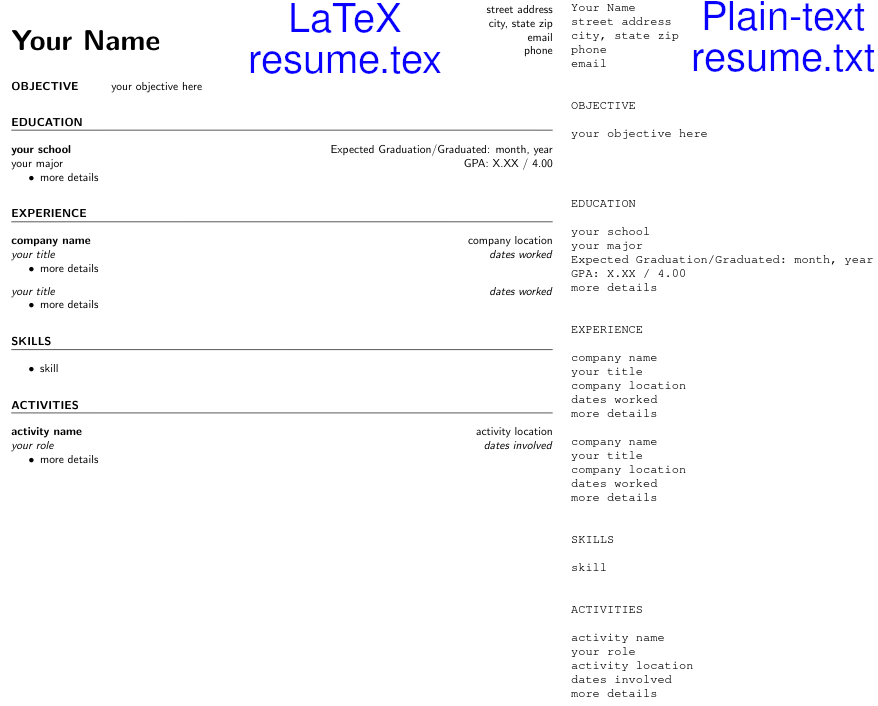

# resume-template
A professional LaTeX resume template with accompanying Python code to generate a machine-readable plain-text version.

# Installation
LaTeX is a typesetting software. It creates formatted documents, often PDF files, using plain-text code. Before using this template, you must have a LaTeX compiler installed. See https://www.latex-project.org/get/ for details on how to get LaTeX for your system.

To make a plain-text (.txt) version of your resume, you will need Python. See https://www.python.org/downloads/ for details on how to get Python for your system.

# Usage
Fill out `resume.tex` with your own information, copying and pasting sections as needed. See the help section in the preamble for more details. Compile when finished.

To generate a plain text version of the resume, run `make_plain_text_resume.py`. The plain text resume is designed to be machine-readable for online resume-parsers when applying to jobs.
